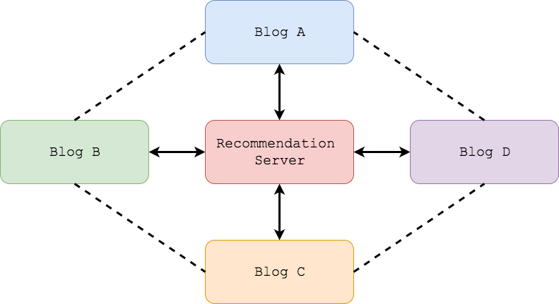

**[Live preview](https://hui-wang.info)**

# Encore: Posts Recommendation Engine for Bloggers
Encore helps bloggers to promote their blogs by recommended posts with both internal and external links.
An internal link points to a post inside the same blog and an external one targets post of other bloggers.



By sharing links through recommended posts, we believe that we can
- create high-quality connections between bloggers
- help readers to discover more interesting posts

# How it works

## Submit posts
The engine collects posts from submissions. In order to be recommendable, a post must have
- a permalink
- a title
- some tags

## Recommendation Algorithm
Two posts are matched when they share at least one tag.

## Fetch recommended posts
One can fetch a list of recommended posts by providing post permalink. In addition, we can configure the number of internal and external links to be included in the list.

# Deployment

## Download
Download the project either with git clone
```
git clone https://github.com/huiwang/encore.git
```
or with [zipped archive](https://github.com/huiwang/encore/archive/master.zip).

## Run with in-memory database
Run the following command to start the server with in-memory database. This is ideal for test purpose.
Be aware that when the server restarts, data is lost.

Under windows
```
cd encore
mvnw.cmd spring-boot:run -Pwith-embedded-mongo
```

Under Linux/MacOS
```
cd encore
mvnw spring-boot:run -Pwith-embedded-mongo
```

## Run with docker
The entire stack including REST server and mongodb is [dockerized](https://github.com/huiwang/encore/blob/master/bin/docker-compose.yml). 
Run the following command in a host where both docker and docker-compose are installed.

```
cd encore/bin
./encore.sh start
```

# Frontends
As mentioned above, the engine collects posts from submissions. Here is the list of supported frontend
- [hexo-recommended-posts](https://github.com/huiwang/hexo-recommended-posts)

# Open Source
To increase the visiblity and build trust among bloggers and readers, the engine is open sourced.
